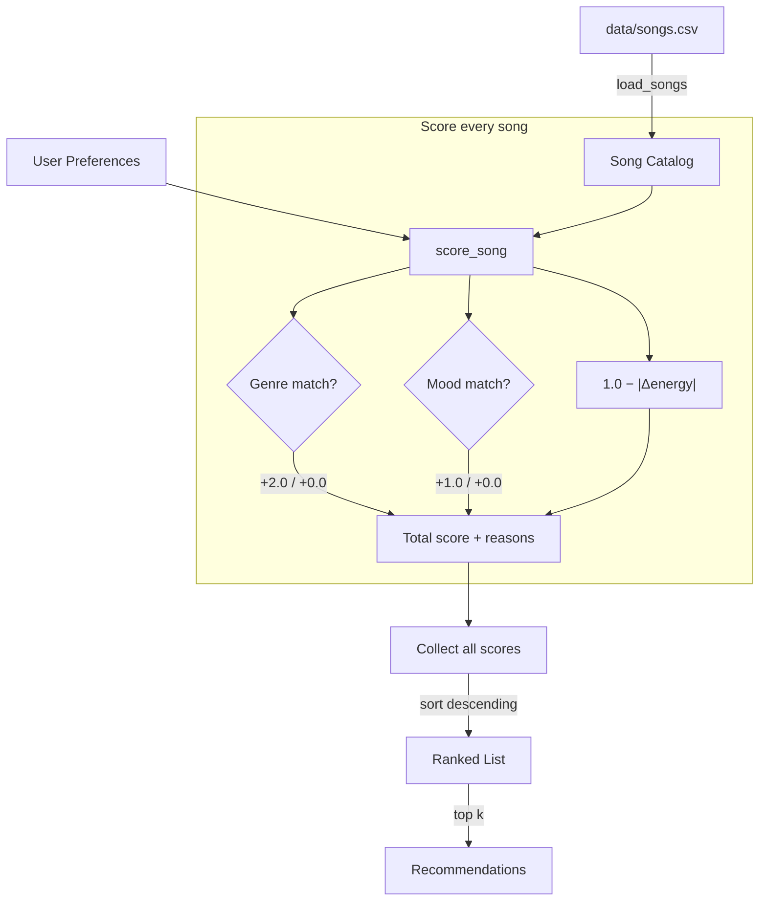
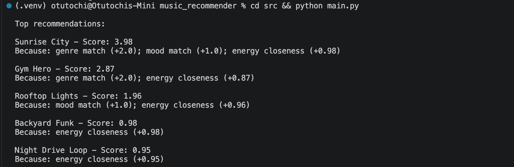
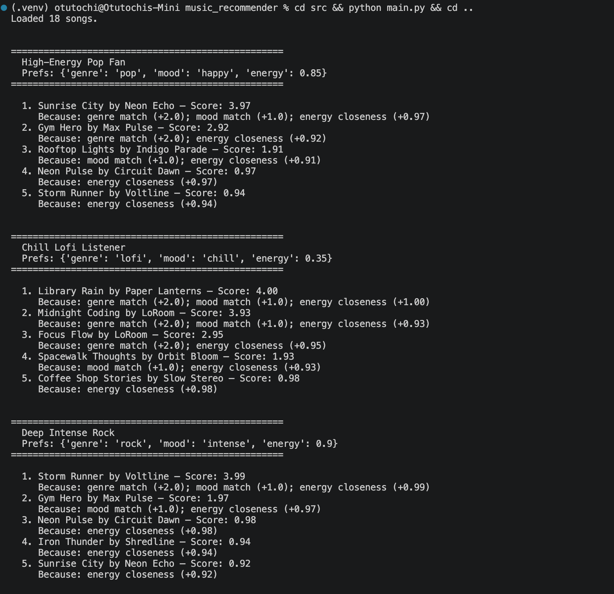
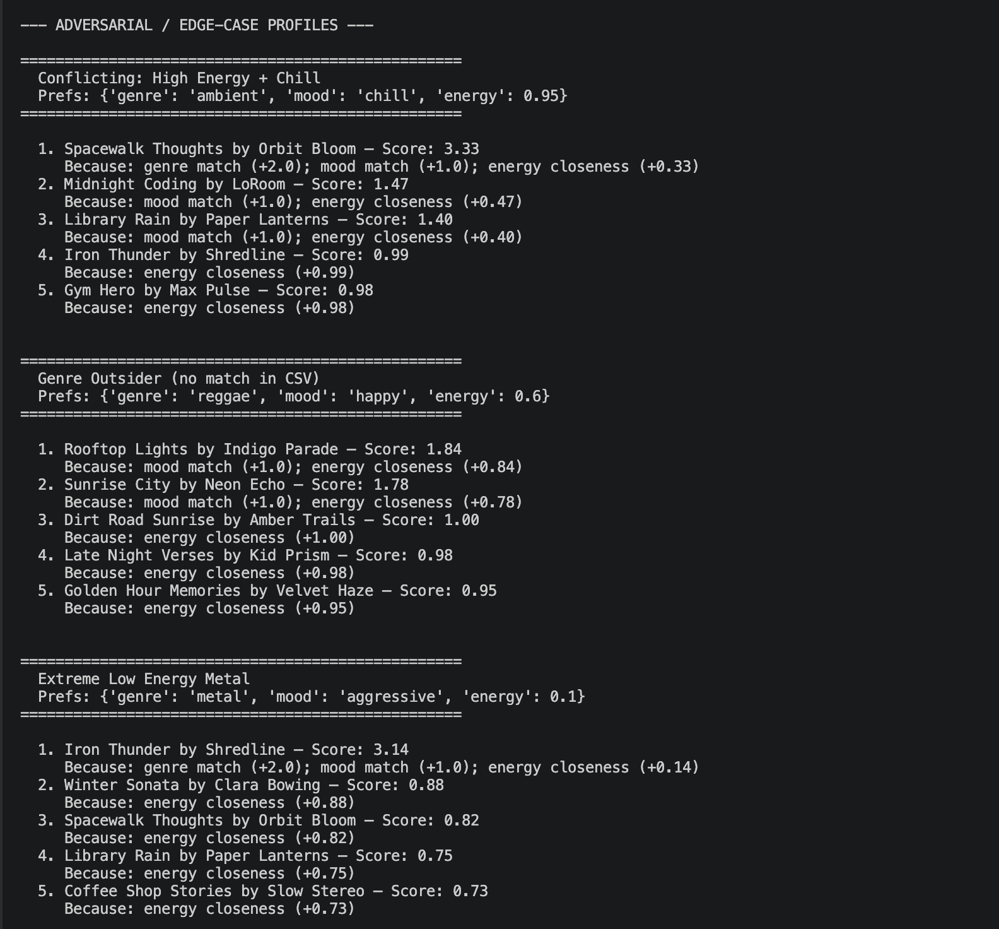

# 🎵 Music Recommender Simulation

## Project Summary

<!-- In this project you will build and explain a small music recommender system.

Your goal is to:

- Represent songs and a user "taste profile" as data
- Design a scoring rule that turns that data into recommendations
- Evaluate what your system gets right and wrong
- Reflect on how this mirrors real world AI recommenders -->

This project simulates a content-based music recommender. It scores every song in a small catalog against a user's taste profile and returns the top matches with human-readable explanations of why each song was chosen.

---

## How The System Works

Real-world platforms like Spotify combine two main approaches: **collaborative filtering** (finding patterns across millions of users' behavior — plays, skips, saves, playlist adds) and **content-based filtering** (matching song attributes like genre, energy, and mood to a user's known preferences). Our simulation focuses on the content-based side, which is easier to explain, debug, and reason about with a small dataset.

### Song Features

Each `Song` in `data/songs.csv` carries these attributes:

| Feature | Type | Role in scoring |
|---------|------|-----------------|
| `genre` | categorical | Primary taste filter (+2.0 for match) |
| `mood` | categorical | Secondary taste filter (+1.0 for match) |
| `energy` | 0.0–1.0 | Closeness to user's target energy |
| `acousticness` | 0.0–1.0 | Matches `likes_acoustic` preference |
| `danceability` | 0.0–1.0 | Available for future scoring expansion |
| `valence` | 0.0–1.0 | Available for future scoring expansion |
| `tempo_bpm` | ~60–180 | Available for future scoring expansion |

### User Profile

A `UserProfile` stores: `favorite_genre`, `favorite_mood`, `target_energy`, and `likes_acoustic`.

### Algorithm Recipe

1. **Scoring Rule** — For each song, compute: `score = 2.0 × genre_match + 1.0 × mood_match + (1.0 − |song_energy − user_energy|)`. Each term also produces a reason string (e.g., "genre match (+2.0)").
2. **Ranking Rule** — Score every song in the catalog, sort descending by score, return the top *k* results with their explanations.

### Data Flow



### Expected Biases and Limitations

- **Genre dominance** — Genre match is worth +2.0, while the maximum energy closeness is only +1.0. A song in the right genre but with mismatched energy will still outscore a perfect-energy song in the wrong genre. This could create a "filter bubble" where the system only recommends one genre.
- **No cross-taste discovery** — A user who likes "chill lofi" will never be shown an "acoustic jazz" track that might feel similar in vibe, because the system compares literal genre strings, not underlying sonic similarity.
- **Small catalog bias** — With only 18 songs, some genres have just one representative. If that song happens to have extreme energy or mood, the system may unfairly judge the entire genre based on a single example.
- **Binary acoustic preference** — `likes_acoustic` is a boolean, but real acoustic preference is a spectrum. A user who "somewhat" likes acoustic gets the same treatment as one who strongly prefers it.

---

## Getting Started

### Setup

1. Create a virtual environment (optional but recommended):

   ```bash
   python -m venv .venv
   source .venv/bin/activate      # Mac or Linux
   .venv\Scripts\activate         # Windows

2. Install dependencies

```bash
pip install -r requirements.txt
```

3. Run the app:

```bash
python -m src.main
```

### CLI Output



### Running Tests

Run the starter tests with:

```bash
pytest
```

You can add more tests in `tests/test_recommender.py`.

---

## Experiments You Tried

### Diverse User Profiles



### Adversarial / Edge-Case Profiles



### Profile Comparisons

- **Pop Fan vs Lofi Listener** — The pop fan's top results are upbeat, high-energy tracks like Sunrise City (0.82 energy), while the lofi listener gets mellow, low-energy picks like Library Rain (0.35 energy). This makes sense because the two profiles point in opposite directions on both genre and energy, so there is almost no overlap in their top 5.

- **Lofi Listener vs Intense Rock** — Both profiles match their genre cleanly, but the lofi results cluster around energy 0.35–0.42 while the rock results sit near 0.90. The mood signal reinforces this: "chill" pulls toward calm tracks and "intense" pulls toward aggressive ones. The system correctly treats these as very different vibes.

- **Pop Fan vs Conflicting (Ambient + High Energy)** — The pop fan gets coherent results because pop songs in the catalog naturally have moderate-to-high energy. The conflicting profile exposes a flaw: the system recommends low-energy ambient tracks despite the user wanting energy 0.95, because genre and mood bonuses outweigh the energy penalty. In a real app, this user would probably hear something like electronic or synth-pop, not a slow ambient track.

- **Genre Outsider (Reggae) vs Everyone Else** — Without a genre match in the catalog, this profile's scores top out around 2.0 instead of 4.0. The system still works — it falls back to mood and energy — but the results feel generic. Any profile that matches a genre in the catalog will always get more confident, higher-scoring recommendations.

### Weight Experiment

We tested halving the genre weight (2.0 → 1.0) and doubling the energy weight (1× → 2×). This made the "Extreme Low Energy Metal" edge case more reasonable — energy-appropriate songs from other genres scored closer to Iron Thunder — but it also weakened genre matching for normal profiles, making the pop fan's results feel less focused. The original weights (2.0 / 1.0 / 1×) were restored as the better default for typical users.

---

## Limitations and Risks

- **Tiny catalog** — Only 18 songs across 15 genres means most genres have a single representative, giving the system no room for variety within a genre.
- **Genre dominance** — The +2.0 genre weight overpowers mood and energy combined, creating filter bubbles where users only see one genre.
- **No lyrics or language awareness** — The system has no idea what a song sounds like beyond numerical attributes; it cannot distinguish English from Spanish or upbeat lyrics from sad ones.
- **Unused features** — Acousticness and danceability exist in the data but are not scored, so users who care about those dimensions get no personalization.
- **No learning** — The system never updates based on user feedback (likes, skips, replays), so it cannot improve over time.


---

## Reflection

My biggest learning moment was discovering how much power a single weight carries. Setting genre to +2.0 seemed harmless, but it effectively guaranteed that genre would dominate every recommendation — even when energy or mood would have been a better signal. That one number created a filter bubble, and I only noticed it when I tested adversarial profiles that deliberately conflicted (like wanting high energy and ambient at the same time). It made me realize that real platforms are making thousands of these small weight decisions, and each one shapes what users see without them knowing.

Using AI tools sped up the mechanical parts — generating CSV rows, scaffolding functions, and formatting output. But I had to double-check the scoring math by hand. When I asked for a "closeness" formula, I needed to verify it actually rewarded proximity (1.0 − |Δ|) instead of just rewarding higher values. The AI also suggested weights I wouldn't have chosen, so I learned to treat its output as a starting draft, not a final answer. The most surprising thing was how three simple rules (genre match, mood match, energy closeness) already produce results that "feel" like real recommendations for typical users — it only breaks down at the edges. If I extended this project, I would wire up acousticness and danceability scoring, add a diversity penalty so the top 5 aren't all from the same genre, and try a much larger song catalog to see if the system scales.

